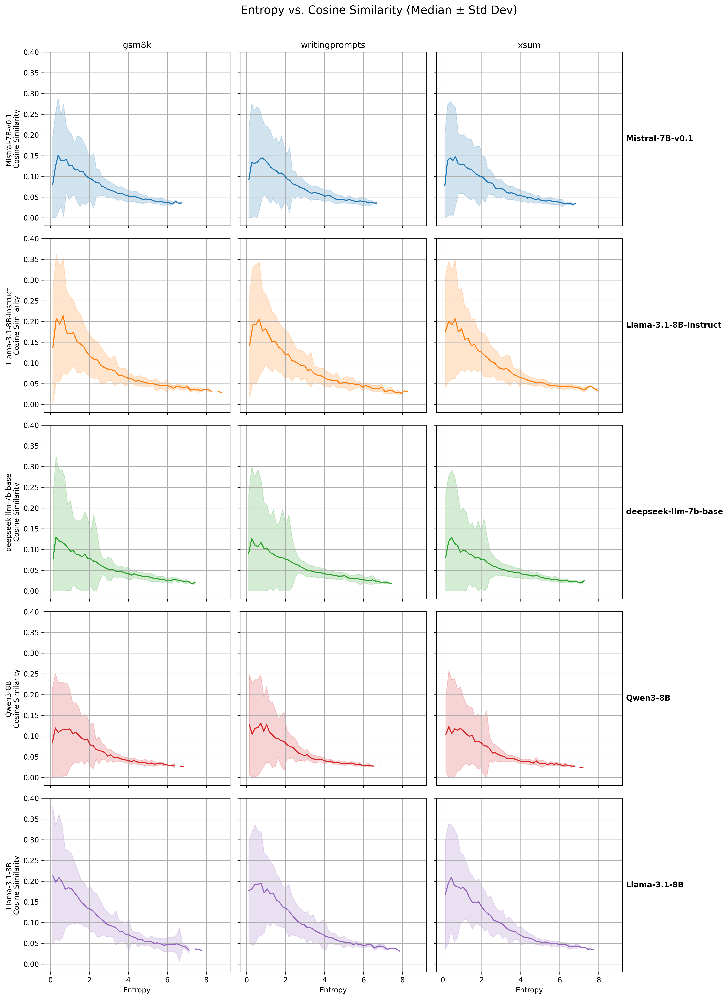

### Math&ML research project about analyzing LLM token probability distributions


https://aclanthology.org/2024.eacl-long.129.pdf#:~:text=The%20term%20diversity%20often%20refers,t%29%2C%20x%3B%20%CE%B8

# Correlation analysis between entropy and cosine similarity
We analyze the correlation between the entropy of each tokens probability distribution that the LLM sampled from, with the average pairwise cosine similarity of the top-p tokens from said distribution.



## Recreating results
First, you need to create a python environment based on the ```requirements.txt``` file, for example:
```
python -m venv .venv && \
    source .venv/bin/activate && \
    pip install -r requirements.txt 
```
To recreate the results of the correlation analysis between entropy and cosine similarity, run the ```correlation_pipeline``` with any compatible model and dataset name, e.g: 
```
python correlation_pipeline.py --dataset_name=xsum --model_name="meta-llama/Llama-3.1-8B"
```
This will create a .pt file in ```results/<dataset_name>/<model_name>```, which contains all necessary results (token entropies & cosines).
These can later be loaded for the data analysis and visualization.  
We also provide a convenience script to run this on a HPC cluster; the script is located in ```scripts/rcp.sh```.

## Models and Datasets
We used five different LLM models for this experiment (though most other models that are loaded as AutoModelForCausalLM using huggingface transformers should work fine as well): 
* ```deepseek-ai/deepseek-llm-7b-base```
* ```meta-llama/Llama-3.1-8B```
* ```meta-llama/Llama-3.1-8B-Instruct```
* ```mistralai/Mistral-7B-v0.1```
* ```Qwen/Qwen3-8B```  

We evaluated each model on three datasets (to add new datasets, you need to add a case for them in ```data_prep.py``` to turn them into a huggingface dataset with one column named ```prompt```): 
* ```gsm8k```
* ```writingprompts```
* ```xsum```

We ran each model-dataset combination with the same parameters: 
* 100 prompts
* 100 max_tokens per prompt

## Data analysis and visualization
The code for the analysis and visualization of these experiements is in ```correlation/correlation_eval.py```. The reason that this is in another file is that the evalution does not need high compute. It can be run via: 
```
python correlation/correlation_eval.py
```

This will create the plots of all models-dataset combinations and save them in ```correlation_eval/correlation.png```. Also, it will calculate Pearson and Spearman correlation scores and save them in the same directory as both .csv and .tex files for easy further use. 

## Model fitting
Currently, this happens in the ```correlation.ipynb``` notebook, but later this will be moved into the ```correlation_eval.py``` file. 
We fit a unimodal model to each of the model-dataset plots medians. 
Later, we will then fit a linear model on the correlation between that model and the cosines, to see how well that model fits the cosine scores.