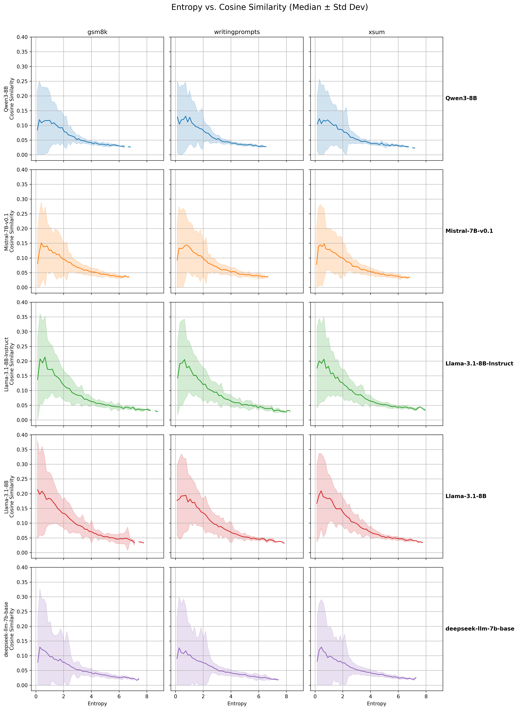
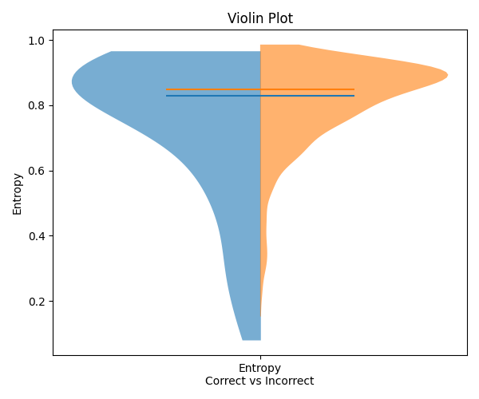
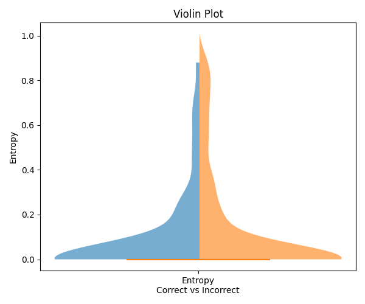

# Quantifying LLM confidence using probabilistic and semantic metrics
This repository contains the code for our research project which is part of the Math&ML class. In this project, we examine different ways to quantify LLM confidence during inference.
We propose a new measure for LLM uncertainty, the top-p token semantic similarity, and explore how this measure correlates with token entropy, an exisiting uncertainty measure. 
Furthermore, we analyze how these metrics are related to model performance and how they are affected by different prompting approaches.
We solidify our findings by reproducing the results over a variety of datasets, models, and prompting approaches.

# Contents
- [Correlation between entropy and semantic similarity](#correlation-analysis-between-entropy-and-cosine-similarity)
- [Semantic similarity as a measure of model accuracy](#accuracy-analysis-over-prompting-techniques-and-entropy-and-cosine)


# Correlation analysis between entropy and cosine similarity
We analyze the correlation between the entropy of each tokens probability distribution that the LLM sampled from, with the average pairwise cosine similarity of the top-p tokens from said distribution.



## Recreating results
First, we need to create a python environment based on the ```requirements.txt``` file, for example:
```
python -m venv .venv && \
    source .venv/bin/activate && \
    pip install -r requirements.txt 
```
To recreate the results of the correlation analysis between entropy and cosine similarity, run the ```correlation_pipeline``` with any compatible model and dataset name, e.g: 
```
python correlation/correlation_pipeline.py --dataset_name=xsum --model_name="meta-llama/Llama-3.1-8B"
```
This will create a .pt file in ```results/correlation_exp/<dataset_name>/<model_name>```, which contains all necessary results (token entropies & cosines).
These can later be loaded for the data analysis and visualization.  

## Models and Datasets
We used five different LLM models for this experiment (though most other models that are loaded as AutoModelForCausalLM using huggingface transformers should work fine as well): 
* ```deepseek-ai/deepseek-llm-7b-base```
* ```meta-llama/Llama-3.1-8B```
* ```meta-llama/Llama-3.1-8B-Instruct```
* ```mistralai/Mistral-7B-v0.1```
* ```Qwen/Qwen3-8B```  

We evaluated each model on three datasets (to add new datasets, you need to add a case for them in ```data_prep.py``` to turn them into a huggingface dataset with one column named ```prompt```): 
* ```gsm8k```
* ```writingprompts```
* ```xsum```

We ran each model-dataset combination with the same parameters: 
* 100 prompts
* 100 max_tokens per prompt

## Data analysis and visualization
The code for the analysis and visualization of these experiments is in ```correlation/correlation_eval.py```. The reason that this is in another file is that the evalution does not need high compute. It can be run via: 
```
python correlation/correlation_eval.py
```

This will create the plots of all models-dataset combinations and save them in ```results/correlation_eval/correlation.png```. Also, it will calculate Pearson and Spearman correlation scores and save them in the same directory as both .csv and .tex files for easy further use. 

# Accuracy analysis over prompting techniques and entropy and cosine
<div style="display: flex; gap: 20px;">
  
  
</div>
We analyze the performance of different LLMs on the GSM8K benchmark with respect to different prompting methods, and how the token entropy and cosine similarity scores are related to the performance.

## Recreating results
First, create a virtual environment using ```requirements.txt```, for example:
```
python -m venv .venv && \
    source .venv/bin/activate && \
    pip install -r requirements.txt 
```
In order to load gated models from Huggingface, you need to save your [Huggingface access token](https://huggingface.co/docs/hub/security-tokens) in ```.env``` like so:
```
HF_TOKEN=<your huggingface token>
```

In order to run the experiments, run: 
```
python accuracy/pipeline.py \
  --experiment_name=<Name of the experiment> \
  --model_name=<Huggingface path of LLM> \
  --n_samples=<max number of samples, otherwise full dataset> \
  --prompting_technique=<cot|baseline|cod> \
  --rerun_buggy_samples=no
```
This will run the experiments and save the results (generated answers, logits and token distributions for each prompt) as a ```.pt``` file in ```results/accuracy_exp/<experiment_name>/```.

Then, to run the evaluation, run 
```
python accuracy/evaluation.py \
    --experiment_name=<Name of the experiment> \
    --rerun=no
```
This will read the results from the ```.pt``` tensor and save the relevant metrics per prompt in ```results/accuracy_exp/<experiment_name>/evaluation_results.csv```.  
It will also create a summary of the evalution with important averages and computed metrics, which will be stored in ```results/accuracy_exp/<experiment_name>/evaluation_summary.json```.  
In order to create the violin plots, we just run the ```accuracy/violin_plots.ipynb``` notebook.  
Additionally, a ```buggy_prompts_to_rerun.csv``` file is generated (see below).

#### Reruns
Since we can count on the LLMs to not generate a valid formatted response for each prompt, we have the option to rerun the prompts. During evaluation, we stored all the prompts with invalid responses in ```results/accuracy_exp/<experiment_name>/buggy_prompts_to_rerun.csv```. 

In order to rerun these prompts, just pass ```--rerun_buggy_samples=yes``` to the pipeline and run it again. This will only run the buggy prompts again and create a new tensor.
```
python accuracy/pipeline.py \
    --experiment_name=<experiment_name> \
    --model_name=<Huggingface model path> \
    --n_samples=<max number of samples, otherwise full dataset> \
    --prompting_technique=<[cot, baseline, cod]> \
    --rerun_buggy_samples='yes'
```

Then, we do another evaluation and pass ```--rerun=yes```. When we do this, it will merge the original tensor with the rerun tensor, leading to a reduced number of invalid responses.
```
python accuracy/evaluation.py \
    --experiment_name=<experiment_name> \
    --rerun=yes
```
## Models and datasets
We used only the ```openai/gsm8k``` dataset for this experiment, since the other datasets don't require the model to output a specific correct answer.  
In our experiments, we used the following models:
* meta-llama/Llama-2-7b-hf
* Qwen/Qwen3-8b
* meta-llama/Meta-Llama-3-8B
* deepseek-ai/deepseek-llm-7b-base  

We evaluated all responses using few-shot prompting with two different prompting techniques:
* Baseline
* Chain-of-thought

Each experiment was conducted using the full test split of the gsm8k dataset (minus the prompts that generated invalid answers, since it's not possible to extract answer token distributions from those).

## Data analysis and visualization
For each experiment in ```results/accuracy_exp/```, we store the following:
* ```evaluation_summary.json```: contains computed metrics like average entropy/cosine over correct/incorrect answers
* ```logtoku_quadrants.png```: Contains quadrant visualization of epistemic and aleatoric uncertainy
* ```cosine_half_violin.png```: contains violin plot for cosine distribution
* ```entropy_half_violin.png```: contains violin plot for entropy distribution  
